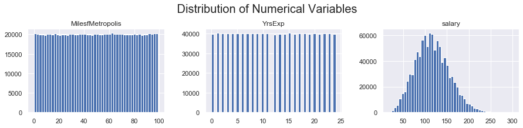

# Predicting Salaries of Future Job Postings

## Introduction
How is a salary for specific job position determined? Is it simply based on experience, industry, years of experience, or is there more to it? I would like to investigate this question using data on present job postings, and their associated salaries. After exploring the data, I will develop a model and plot which features are the most important in determining salaries of newly posted positions. The language of implementation is Python, using packages such as pandas, numpy, matplotlib, seaborn, and sklearn.

## Data Cleaning
This dataset contains one million observations, and variables included are:

 -  company ID: comapny Id in which posts the opening 
 -  job type: level of seniority, such as CEO, CFO, or junior
 -  degree: level of degree, such as Phd, Masters, Bachelors or None
 -  major: university major included in job description
 -  industry: industry in which the company operates in
 -  experience: number of years of experience required for the listed job
 -  distance: number of miles away from major city
 -  salary (target): posted salary in a job posting
  
Although the data is relatively clean, I deleted 5 observations becasue salary are listed 0. Also, I kept the outliers because it only account for less than 1% of data points. 

## Exploratory Data Analysis
In terms of categoricall data EDA, the findings are as follow:

- Not surprisingly, CEO jobtype has the highest average salary among all job types. VP has the highest mean salary among those who are not C-levels.
- Overall, mean salary of different majors are roughly the same. Engineering majors have the highest mean salary while non has the lowest mean salary 
- Given current economy, it is not a surprised that Web and Finance industry are 2 of the top 3 industires. However, Oil industry has the highest mean salary
- Generally speaking, those who have a bachelors degree or higher have a mean salary greater than high_school or none degree owners. However, there is no significance difference in the mean salary of higher education group. Doctoral degree owners only have a slighly better mean salary than masters degreee holders.

After exploring the categorical variables and their relationships to the salary variable, I inspected the numeriacl variables to see if they follow a normal distribution. 

- The distance from Metropolis has a uniform distribution, showing all observations have similar distance to Metropolis. 
- The salary graph shows slight skewness to the right, but the shape overall follows normal distribution. The mean salary is higher than the median of salary for this dataset.
- Years of experience variable has a uniform shape and follows a normal distribution.

Finally, I examined the relationship between other numerical independent variables and salary. Salaries generally decrease with larger distance from the metropolis; Salaries tend to increase with years of experience.

## Model Development 

Because this is a regression problem with the dependent variable being a continuous one, MSE is a simple and fitting choice to use it as a metric for my model. I used the difference from average salary as my baseline model to gauge the performance of different machine learning models. The three implemnted machine learning models to improve MSE are as follow:

- Linear Regression: our data follows a linear shape according to the EDA
- Decision Trees: DT is a basic and fast approach for modeling, and performs well with linear relationships problems
- Gradient Boosting: Given a regression problem, gradient boosting offers great way for weak learners to improve their performance, and is often used to minimize the MSE

The summarized MSE are 3 models are as follow:

| Model  | MSE |
| ------------- | ------------- |
| Baseline  | 1499.017 |
| Linear Regression  | 384.444  |
| Decision Tree  | 700.451  |
| Gradient Boosting  | 0.013  |

## Conclusion

I have developed a model that can predict future salaries of job postings based on salaries of current job postings. After performing the exploratory data analysis, I developed three models and compared their mean squared errors to measure the performance against the baseline model. Gradient boosting model performs the best with the training data. I used the model to predict the salary on testing data, and saved the results of the prediction in a csv file. I also included the analysis of feature importances, and saved it in a separate csv file.
